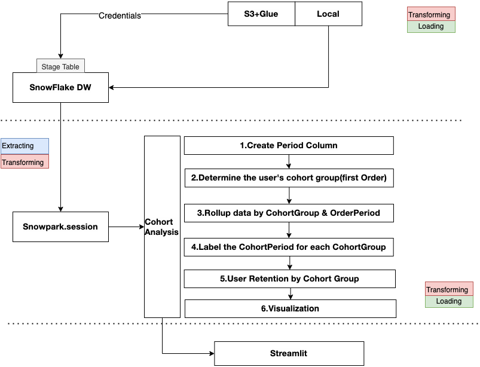

# Cohort-Analysis-on-snowflake
 
 
 

## Quick Portral
| **--->** [1.Script](Analysis.ipynb) |

| **--->** [2.Front-end](pages/Food_Cohort_Analysis.py) |

| **--->** [2.Website by Streamlit](https://dduan-zw-cohort-analysis-on-snowflake-main-csxkkt.streamlit.app/Food_Cohort_Analysis) |
### Tech Stacks
- Python
- Streamlit
- Snowflake DW
- SnowPark
- AWS S3
- Cohort Analysis

## 1.Overall Architecture

## 2. Streamlit Web pages
#### I. Bike Sales Dataset
This dataset comes from the hypothetical KPMG.
We focus on transaction sheet to be dataset for cohort analysis use.
Objective: Find customer transaction retention funnel.
Each row in the dataset contains information about an individual bike purchase:

- Who bought it
- How much they paid
- The bike's `brand` and `product line`
- Its `class` and `size`
- What day the purchase happened
- The day the product was first sold
#### I Objective:
The underlying code groups those purchases into cohorts and calculates the `retention rate` (split by month) so that one can answer the question:
*if I'm making monthly changes to my store to get people to come back and buy more bikes, are those changes working?"*
These cohorts are then visualized and interpreted through a heatmap [powered by Plotly](https://plotly.com/python/).

#### II. Food deliver Dataset
This dataset comes from the hypothetical Relay Food company. The data spans from June 1, 2009 to September 3, 2010 and is available in CSV format (downloadable here).
Each row in the dataset contains information about an individual food order:
- Who bought it
- How much they paid
- The pick-up date
#### II. Objective:
The underlying code groups those purchases into monthly cohorts (with the user's cohort group based on their first order) and calculates the
`retention rate` so that one can answer the question:
*if I'm making monthly changes to my shop to get people to come back and order more, are those changes working?"*
These cohorts are then visualized and interpreted through a heatmap [powered by Plotly](https://plotly.com/python/).

#### II. Key Results:
- We can see from the above chart that fewer users tend to purchase as time goes on. 
- we can also see that the 2009-01 cohort is the strongest, which enables us to ask targeted questions about this cohort compared to others：
    - Posterior data (Inference) <--> Prior data(Validation A/B test) 
    - what other attributes (besides first purchase month) do these users share which might be causing them to stick around? 
    - How were the majority of these users acquired? Was there a specific marketing campaign that brought them in? 
    - Did they take advantage of a promotion at sign-up? 
    - The answers to these questions would inform future marketing and product efforts.
- Example: 2009-Feb and 2010-Feb second period retention rate is 20% and 19%, which are the most min RATE of second period.
    - 2010-Jan second period retention rate is 50%,it is the highest rate. Any activity in here? Any version update in this period?
    - We need also look at other metrics' movement such as revenue retention to justify product strategy. 

## 3.
